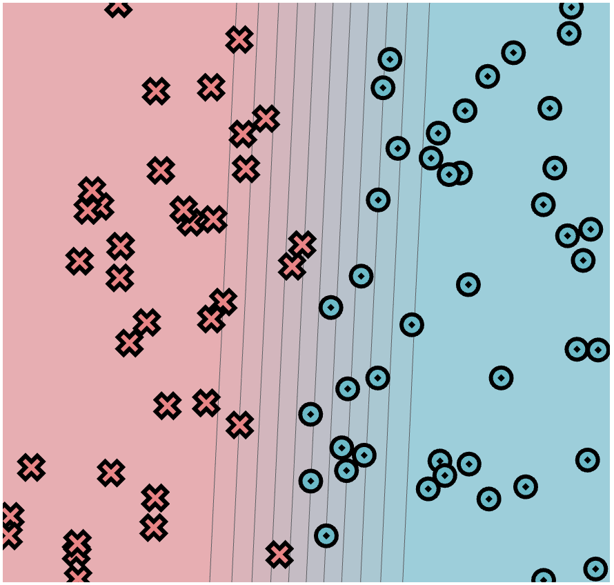

# MiniTorch Module 0

My solutions to [module 0](https://minitorch.github.io/module0.html) of [minitorch](https://minitorch.github.io/)

## Task 0.5

For the final task in this module we manually fit a minitorch model to a dataset using a streamlit app. Below are the parameters I chose and the resulting fit

**Parameters**:
- `linear.weight_0_0`: `-7.22`
- `linear.weight_1_0`: `0.32`
- `linear.bias_0`: `3.47`

